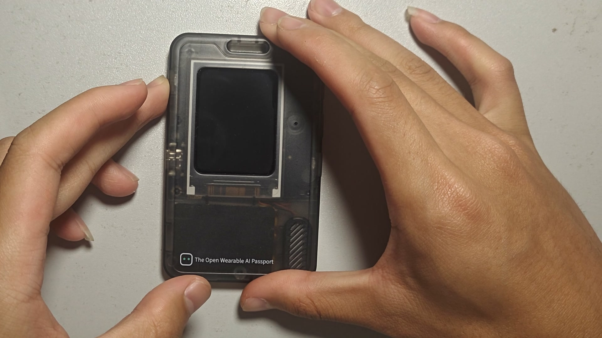
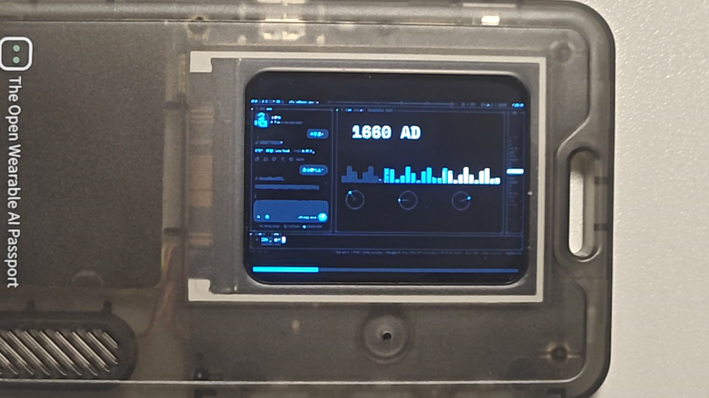
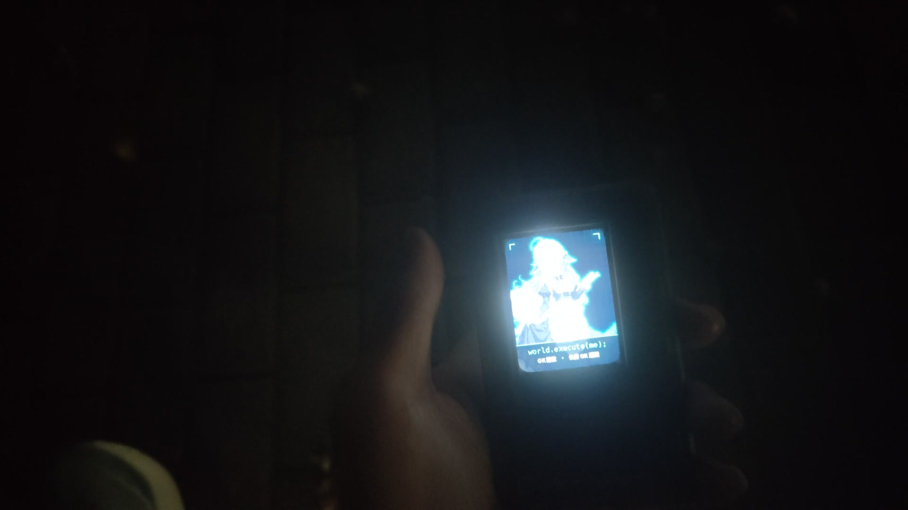

# world.execute(me); —— FoloToy AI Passport 专属播放器固件

<p align="center">
  
</p>

<p align="center">
  <a href="https://ai-passport.folotoy.cn/plays/909/?v=1899-2"></a>
  <a href="LICENSE"></a>
  
  
</p>

---

## 📖 项目简介 (Introduction)

本项目是专为 **FoloToy AI Passport**（ESP32-S3 核心的 99 元随身透明工牌）定制开发的纯离线版《world.execute(me);》专属多媒体播放器固件。

灵感源于 B 站 UP 主 `@MisakaZentai` 的二创 PV 代码，将 Mili 的经典神作《world.execute(me);》与“赛博大肥鱼”（DeepSeek 娘）形象移植进这台微型嵌入式设备中。

- **无需联网**：纯离线运行，开机即用，零配置要求。
- **开机即达**：开机直出赛博朋克大肥鱼 HUD 封面（240×320 竖屏待机）。
- **一键起播**：按正面 **OK 键** 自动切换为横屏（320×240），全速播放音画严格同步的整首完整歌曲。
- **随时返回**：长按 OK 键随时退出回封面，整首歌曲播放完毕后亦会自动优雅淡出切回待机状态。
- **硬件直驱**：移除上层繁重 UI 框架，采用轻量级差分图层解码与双缓冲直驱，运行丝滑不卡顿。

---

## 📷 实机展示 (Hardware Showcase)

<p align="center">
  
  
</p>

<p align="center">
  
</p>

---

## 🎮 操作说明 (Usage Instructions)

| 操作 | 动作 | 说明 |
| :--- | :--- | :--- |
| **开机就绪** | 拨动电源开关 | 开机直出大肥鱼赛博 HUD 封面，进入待机状态 |
| **开始播放** | **短按 OK 键** | 自动横屏，倒计时后同步播放《world.execute(me);》整曲与动画 |
| **暂停 / 继续** | 播放中 **短按 OK 键** | 暂停或继续影音播放 |
| **音量调节** | 播放中按 **侧边 UP / DOWN 键** | 调整机身板载扬声器播放音量 |
| **退出返回** | **长按 OK 键** 或播放自然结束 | 停止播放并返回开机待机封面 |

---

## ⚡ 快速体验（无需配置编译环境）

如果你手头有 **FoloToy AI Passport** 设备：

1. 使用 USB-C 数据线将设备连接至电脑（推荐 Chrome / Edge 浏览器）。
2. 打开官方社区固件发布页：
   👉 **[https://ai-passport.folotoy.cn/plays/909/?v=1899-2](https://ai-passport.folotoy.cn/plays/909/?v=1899-2)**
3. 点击页面中的 **“安装”** 按钮，按浏览器弹窗选择设备对应的串口，即可一键免编译自动烧录体验！

---

## 🛠️ 本地编译与烧录 (Build from Source)

如果你希望自行修改代码或本地构建固件：

### 1. 环境准备
- [ESP-IDF v5.4+](https://docs.espressif.com/projects/esp-idf/zh_CN/latest/esp32s3/get-started/)
- 确保已正确配置 `IDF_PATH` 与工具链环境变量。

### 2. 克隆仓库
```bash
git clone https://github.com/eryuemu/ai-passport-world-execute-me.git
cd ai-passport-world-execute-me
```

### 3. 构建与烧录
```bash
# 编译工程
idf.py build

# 连接设备后烧录并开启串口监视器
idf.py flash monitor
```

---

## 📁 目录结构 (Repository Structure)

```text
├── CMakeLists.txt              # 顶层构建配置
├── sdkconfig.defaults          # ESP32-S3 默认板级配置 (PSRAM、Flash、时钟)
├── partitions.csv              # 8MB Flash 专用存储分区表
├── components/                 # AI Passport 板级支持包 (BSP: 屏幕/音频/按键/电源)
├── main/
│   ├── main.c                  # 业务状态机与直驱主流程
│   ├── cover.c / cover.h       # 赛博大肥鱼全屏封面推流驱动
│   ├── deepseek_cover.bin      # 封面高精点阵二进制数据 (RGB565)
│   ├── world_execute_player.c  # 影音同步播放引擎 (双缓冲渲染与 I2S 音频流)
│   ├── world_execute.h         # 数据流结构体与解码协议定义
│   ├── world_execute_data.bin  # 完整整曲压缩多媒体复合数据包
│   └── tinf/                   # 极简快速 Zlib 解压库
├── tools/
│   └── package_world_execute.py # 视频帧差分提取、抖动量化与音视频打包工具
└── docs/
    └── images/                 # 文档配图与实拍展示
```

---

## 📜 版权声明与致谢 (Credits & Attribution)

本固件与项目为个人业余兴趣制作的**非商用硬件同人技术探索**，严禁用于任何商业牟利。

- **音乐原作**：Mili - 《world.execute(me);》
- **原二创 PV / 代码灵感**：UP 主 `@MisakaZentai`（B 站视频：`BV1xCai6aE9g` / GitHub：`MisakaZentai/world-execute-me-dsh-pv`）
- **大肥鱼角色形象**：溟月 © 上善无形 / 女仆版 ZipZipPipe / 立绘 Small-tailqwq（遵循 [CC BY-NC-SA 4.0](https://creativecommons.org/licenses/by-nc-sa/4.0/) 协议）
- **硬件平台**：[FoloToy AI Passport](https://ai-passport.folotoy.cn) (ESP32-S3)
